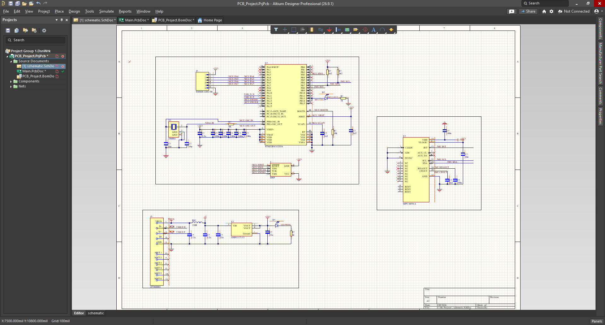
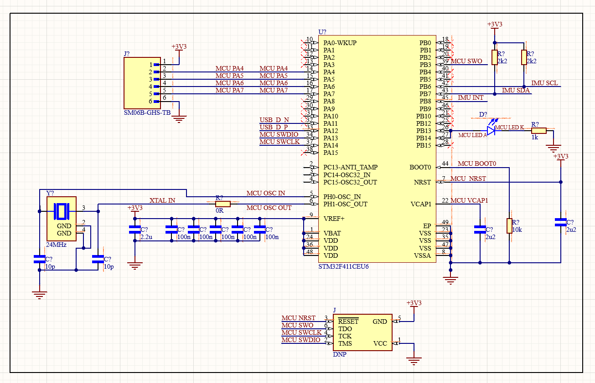
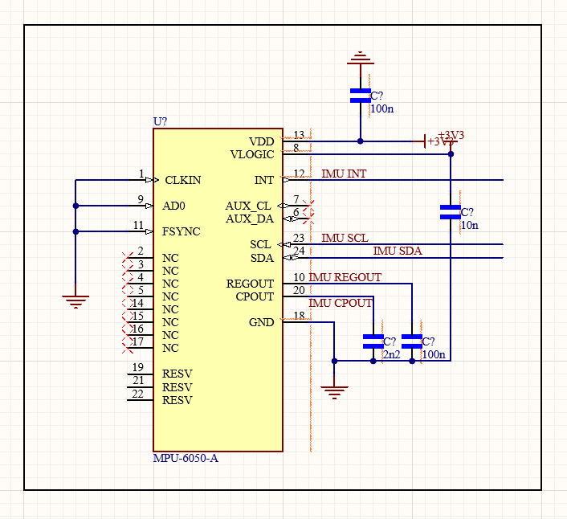
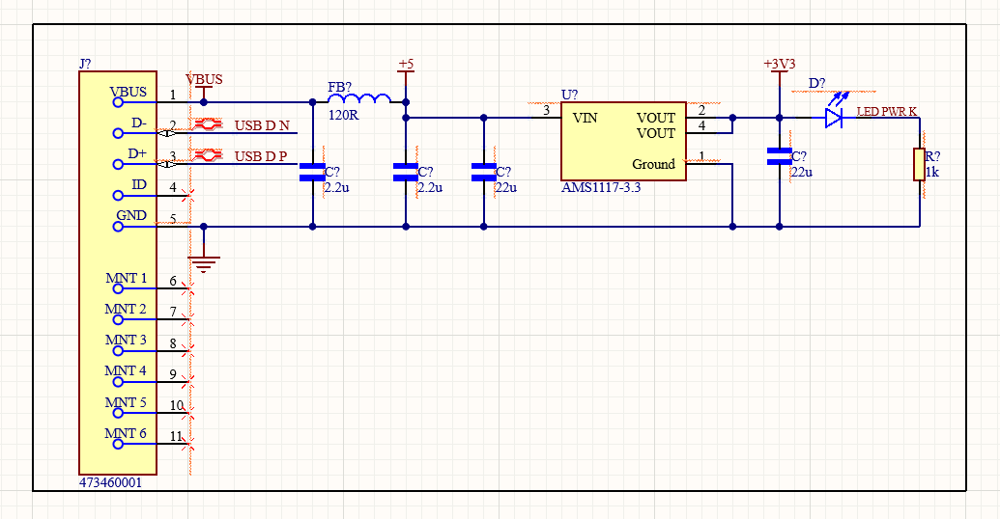
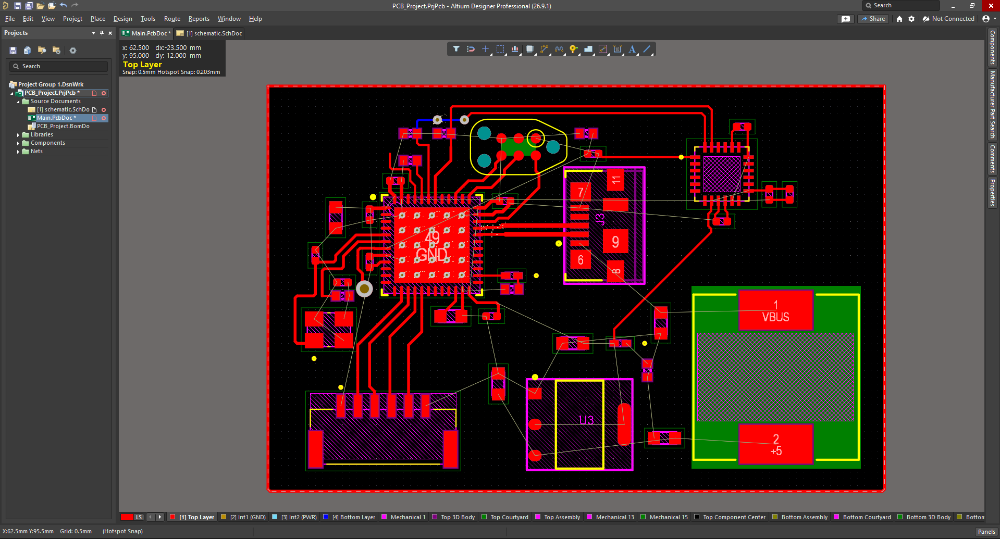
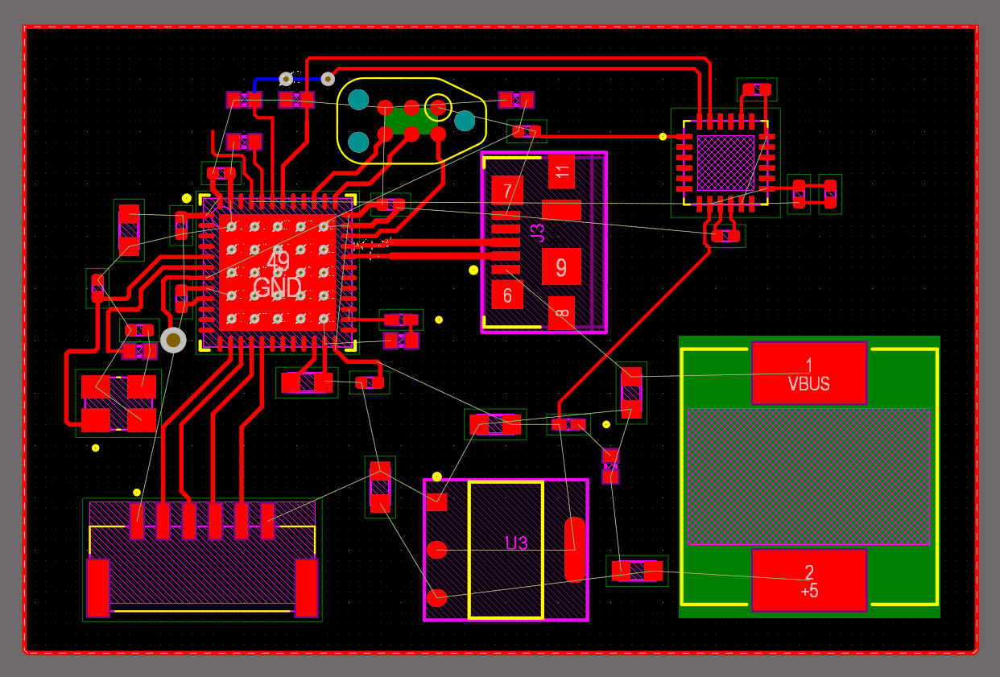
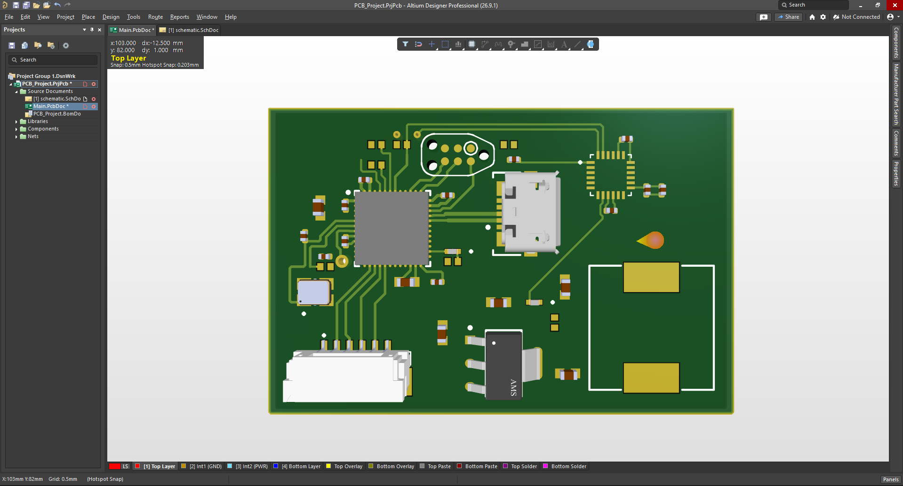
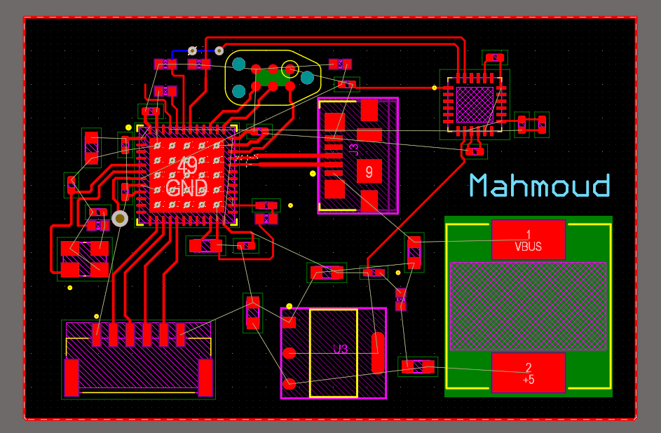
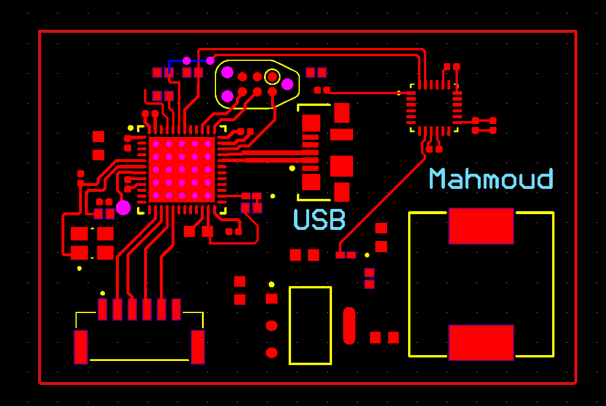
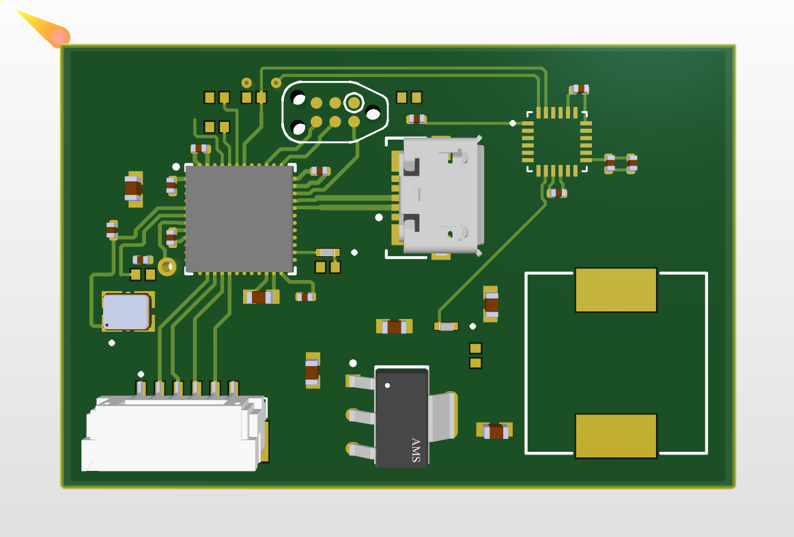

# ASURT LV Solo Mission — PCB Project

Custom PCB designed in Altium Designer as part of the ASURT (Ain Shams University Racing Team)
Low Voltage sub-team Solo Mission. The board was built by following a complete Altium Designer
PCB design walkthrough — schematic capture, component/footprint sourcing (SnapEDA), PCB layout,
and full fabrication output generation (Gerbers + NC drill file) for manufacturing.

## Contents

- `PCB_Project/schematic.SchDoc` — full schematic
- `PCB_Project/Main.PcbDoc` — PCB layout
- `PCB_Project/parts/` — component libraries (schematic symbols + footprints)
- `PCB_Project/Project Outputs for PCB_Project/` — fabrication outputs (Gerber layers + NC drill file)

## Tools Used

- **Altium Designer** — schematic capture and PCB layout
- **SnapEDA** — component footprint/symbol libraries

## Schematic

STM32F411 MCU, MPU-6050 IMU, and USB/3V3 power regulation.

## PCB Layout

## 3D View

